# My Academic Projects Showcase 🎉

## Project 1: [Computer Vision cousework](https://github.com/kakayuii/MyProjects/tree/main/coursework/Deep%20Learning%20and%20Computer%20Vision)
Description: classification, object segmentation and counting

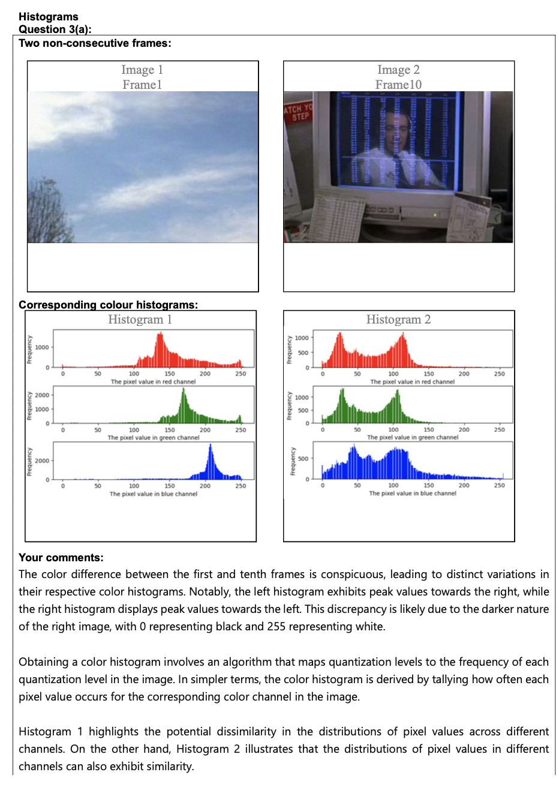

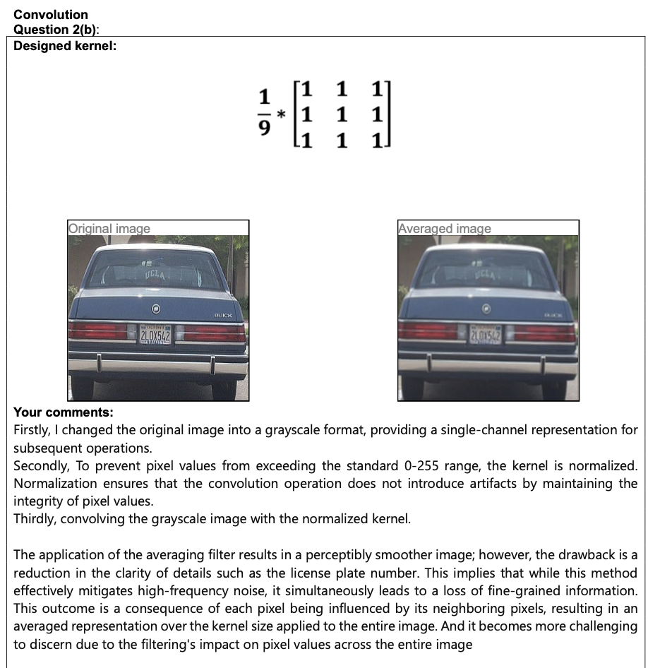

## Project 2: [Computer Vision paper](https://github.com/kakayuii/MyProjects/blob/main/coursework/introduction%20to%20computer%20vision/2/Tianxiu%20Ma_230277302_Coursework2_ECS709U%3AECS709P.pdf)

Description: A research paper on optical flow estimation.

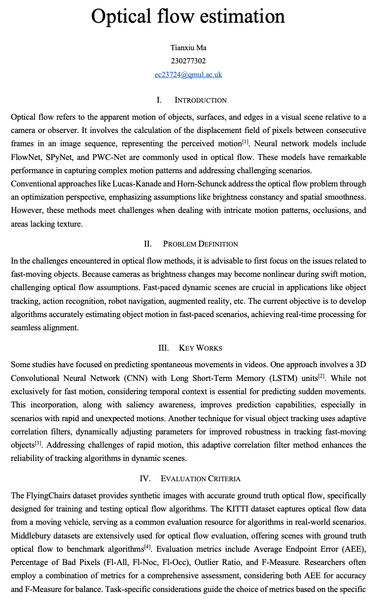

## Project 3: [Machine Learning cousework](https://github.com/kakayuii/MyProjects/tree/main/coursework/machine%20learning)

Description:supervised learning and unsupervised learning

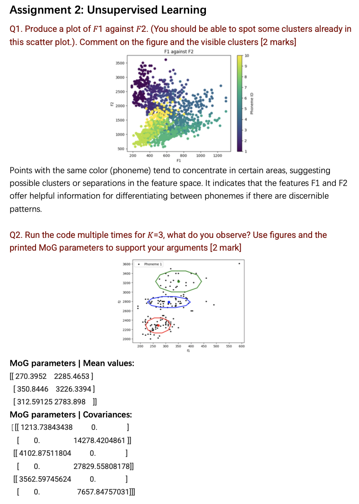

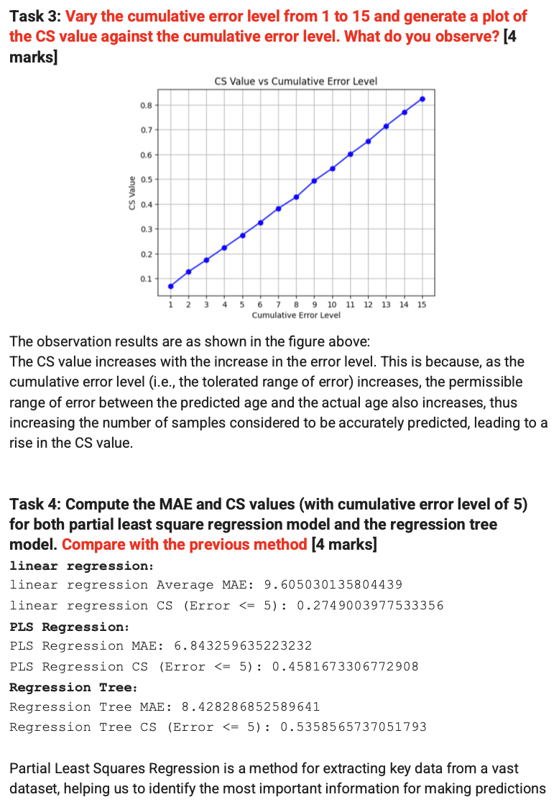

## Project 4: [Deep Learning and Computer Vision paper](https://github.com/kakayuii/MyProjects/blob/main/coursework/Deep%20Learning%20and%20Computer%20Vision/3/report-230277302.pdf)

Description: Deeper Networks for Image Classification

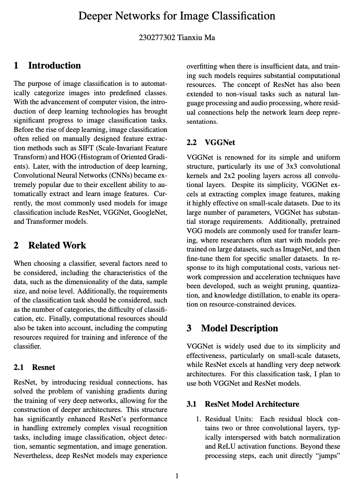

## Project 4: [Neural Networks and Deep Learning](https://github.com/kakayuii/MyProjects/tree/main/coursework/Neural%20Networks%20and%20Deep%20Learning)

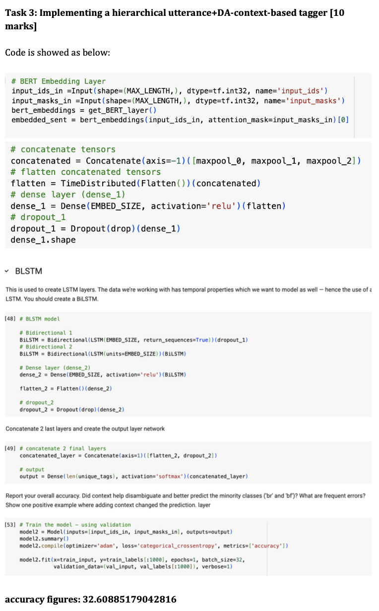

<!-- ## Project 5: [Python Dashboard](https://github.com/kakayuii/dashboard)
 -->

## Project 5: Course content of Computer Vision

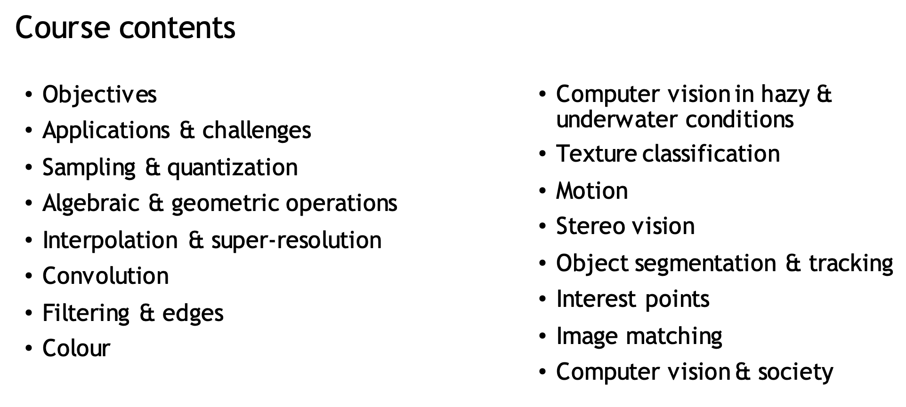

## Project 6: Course content of Machine Learning for Visual Data Analysis

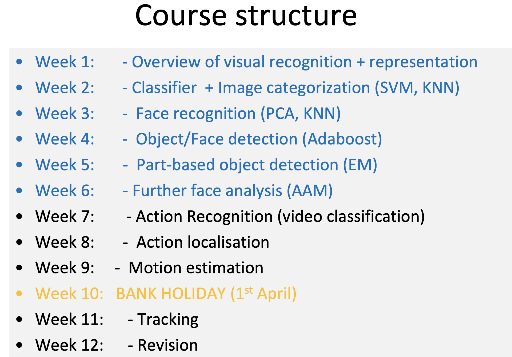

## Project 7: Course content of Neural Networks and NLP

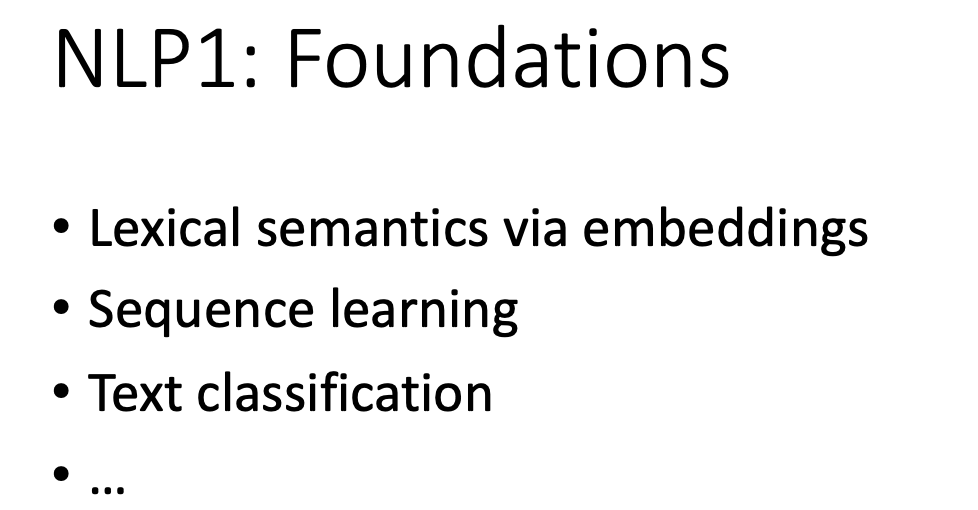

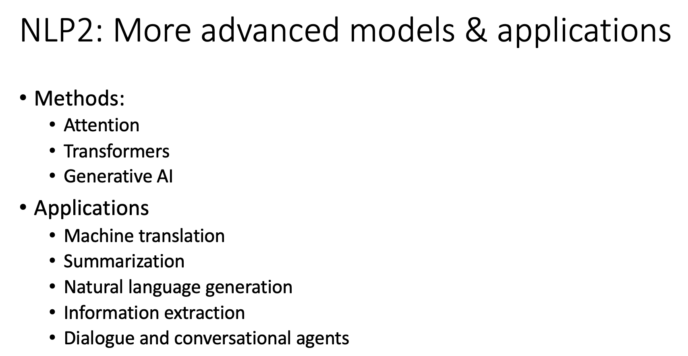
